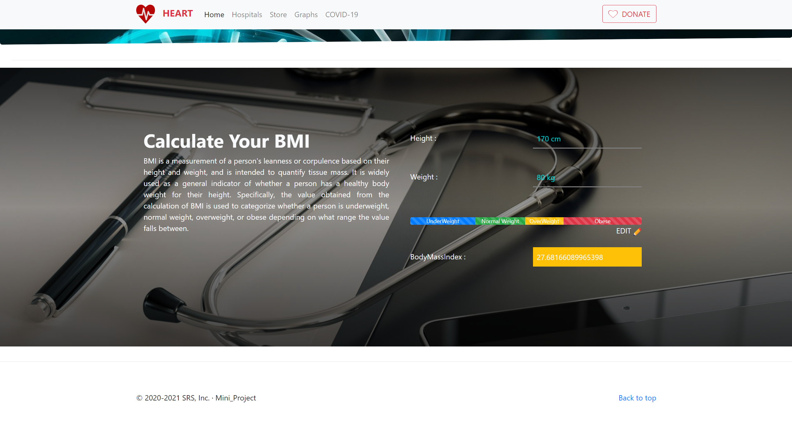
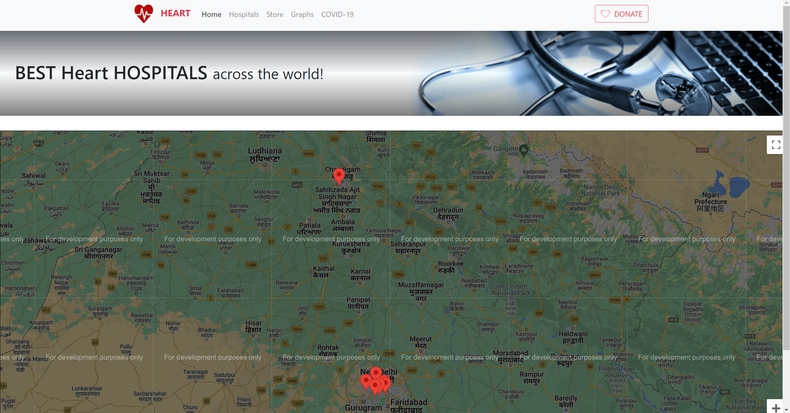
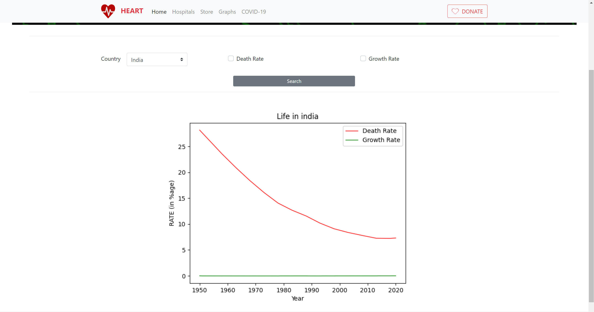
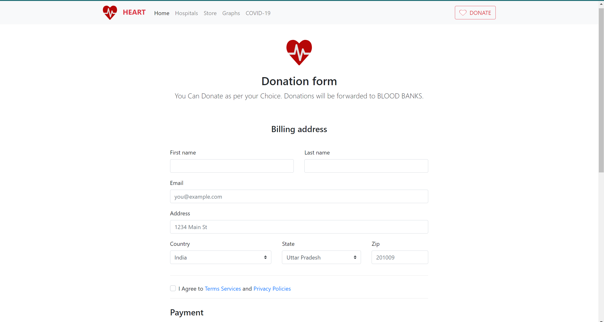

# HeartProject

# To Run this Project

1. Clone the repository to your local machine using `git clone`
2. Open the project in Terminal
3. Run `python manage.py runserver`
4. Open the link in your browser

# To Run the Tests

1. Open the project in Terminal
2. Run `python manage.py test`

## Screenshots for Reference

    

    

    

